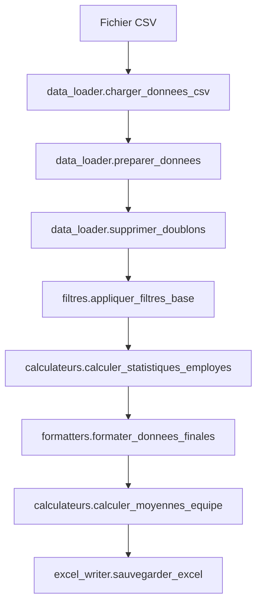

# 🛠️ PMT Analytics - Guide Développeur

## 📋 Vue d'ensemble

**PMT Analytics** est une application Python avec interface graphique Tkinter pour l'analyse des plannings de maintenance technique d'Enedis. Le projet utilise une architecture modulaire pour faciliter la maintenance et les évolutions.

## 🏗️ Architecture du projet

```
StatistiquePMT/
├── 📁 assets/                  # Ressources (icônes, images)
│   └── pmtIcon.ico
├── 📁 scripts/                 # Scripts de build et utilitaires
│   ├── creer_exe_macos.py     # Création d'exécutable macOS
│   ├── lancer_app.sh          # Script de lancement
│   └── README.md
├── 📁 utils/                   # Modules métier
│   ├── __init__.py
│   ├── calculateurs.py        # Calculs statistiques
│   ├── data_loader.py         # Chargement des données CSV
│   ├── excel_writer.py        # Export Excel
│   ├── filtres.py             # Filtrage des données
│   ├── formatters.py          # Formatage des résultats
│   ├── horaires.py            # Gestion des horaires
│   ├── reporter.py            # Génération de rapports
│   └── statistics.py          # Statistiques avancées
├── 📄 config.py               # Configuration globale
├── 📄 gui_interface.py        # Interface graphique principale
├── 📄 main.py                 # Point d'entrée
├── 📄 requirements.txt        # Dépendances Python
└── 📄 README.md              # Documentation principale
```

## 🔧 Configuration de l'environnement de développement

### Prérequis

- **Python 3.8+** (testé avec Python 3.9-3.12)
- **pip** pour la gestion des packages
- **Git** pour le versioning

### Installation

```bash
# Cloner le repository
git clone <repository-url>
cd StatistiquePMT

# Créer un environnement virtuel
python -m venv .venv

# Activer l'environnement virtuel
# macOS/Linux:
source .venv/bin/activate
# Windows:
.venv\Scripts\activate

# Installer les dépendances
pip install -r requirements.txt
```

### Lancement en mode développement

```bash
# Interface graphique
python gui_interface.py

# Ou via le point d'entrée principal
python main.py
```

## 📦 Dépendances principales

| Package    | Version  | Usage                        |
| ---------- | -------- | ---------------------------- |
| `pandas`   | ^2.0.0   | Manipulation des données CSV |
| `openpyxl` | ^3.1.0   | Export Excel                 |
| `tkinter`  | Built-in | Interface graphique          |
| `pathlib`  | Built-in | Gestion des chemins          |
| `datetime` | Built-in | Gestion des dates            |

## 🧩 Modules détaillés

### `config.py`

Configuration centralisée de l'application :

```python
ANNEE = '2024'
CODES_EQUIPES = ['PV IT ASTREINTE', 'PV B ASTREINTE', ...]
HORAIRE_DEBUT_REFERENCE = '07:30:00'
CSV_ENCODING = 'latin1'
```

### `utils/data_loader.py`

Chargement et validation des données CSV :

- `charger_donnees_csv()` : Lecture du fichier CSV
- `preparer_donnees()` : Nettoyage et préparation
- `supprimer_doublons()` : Déduplication

### `utils/calculateurs.py`

Calculs statistiques métier :

- `calculer_statistiques_employes()` : Stats par employé
- `calculer_moyennes_equipe()` : Moyennes par équipe

### `utils/excel_writer.py`

Export vers Excel avec formatage :

- `sauvegarder_excel()` : Export principal
- Support des chemins personnalisés
- Formatage automatique des colonnes

### `gui_interface.py`

Interface graphique principale :

- Classe `PMTAnalyticsInterface`
- Gestion des événements utilisateur
- Threading pour les opérations longues
- Gestion d'erreurs robuste

## 🔄 Flux de traitement des données



## 🧪 Tests et qualité

### Structure des tests

```bash
# Lancer les tests (à implémenter)
python -m pytest tests/

# Tests manuels avec fichiers d'exemple
python test_export.py
```

### Conventions de code

- **PEP 8** pour le style Python
- **Docstrings** pour toutes les fonctions publiques
- **Type hints** recommandés pour les nouvelles fonctions
- **Gestion d'erreurs** explicite avec try/except

### Exemple de fonction bien documentée :

```python
def calculer_statistiques_employes(df_filtre: pd.DataFrame) -> pd.DataFrame:
    """
    Calcule les statistiques détaillées pour chaque employé.

    Args:
        df_filtre: DataFrame filtré des données de planning

    Returns:
        DataFrame avec les statistiques par employé

    Raises:
        ValueError: Si le DataFrame est vide
        KeyError: Si les colonnes requises sont manquantes
    """
```

## 🚀 Build et distribution

### Création d'exécutable macOS

```bash
# Utiliser le script automatisé
python scripts/creer_exe_macos.py

# Ou manuellement avec PyInstaller
pyinstaller --onefile --windowed gui_interface.py
```

### Structure de l'exécutable généré

```
dist/
└── PMTAnalytics.app/
    └── Contents/
        ├── MacOS/
        │   └── PMTAnalytics
        ├── Resources/
        └── Info.plist
```

## 🔧 Configuration avancée

### Modification des équipes analysées

Dans `config.py` :

```python
CODES_EQUIPES = [
    'NOUVELLE_EQUIPE',
    'AUTRE_EQUIPE'
]
```

### Ajout de nouvelles colonnes Excel

Dans `config.py` :

```python
COLONNES_FINALES = [
    'Nom', 'Prénom', 'Équipe',
    'Nouvelle_Colonne',  # Ajouter ici
    # ...
]
```

### Personnalisation des horaires

```python
HORAIRE_DEBUT_REFERENCE = '08:00:00'
HORAIRE_FIN_REFERENCE = '17:00:00'
```

## 🐛 Debugging et logs

### Activation des logs détaillés

```python
import logging
logging.basicConfig(level=logging.DEBUG)
```

### Points de debug courants

- Vérification du format CSV dans `data_loader.py`
- Validation des calculs dans `calculateurs.py`
- Gestion des erreurs d'export dans `excel_writer.py`

## 📈 Métriques et performance

### Temps de traitement typiques

- **Fichier 1000 lignes** : ~2-3 secondes
- **Fichier 10000 lignes** : ~5-10 secondes
- **Export Excel** : ~1-2 secondes

### Optimisations possibles

- Utilisation de `pandas.read_csv()` avec `chunksize`
- Cache des calculs intermédiaires
- Parallélisation avec `multiprocessing`

## 🔄 Workflow de développement

### Branches Git

- `main` : Version stable
- `develop` : Développement en cours
- `feature/nom-feature` : Nouvelles fonctionnalités
- `hotfix/nom-bug` : Corrections urgentes

### Processus de contribution

1. **Fork** du repository
2. **Créer une branche** feature
3. **Développer** avec tests
4. **Commit** avec messages clairs
5. **Pull Request** vers develop

### Messages de commit

```bash
# Format recommandé
git commit -m "🐛 Fix: Correction du bug d'export Excel"
git commit -m "✨ Feat: Ajout du support des équipes personnalisées"
git commit -m "📚 Docs: Mise à jour du README développeur"
```

## 🚨 Gestion d'erreurs

### Erreurs courantes et solutions

| Erreur               | Cause                | Solution                    |
| -------------------- | -------------------- | --------------------------- |
| `FileNotFoundError`  | Fichier CSV manquant | Vérifier le chemin          |
| `UnicodeDecodeError` | Mauvais encodage     | Forcer `latin1`             |
| `KeyError`           | Colonne manquante    | Valider le format CSV       |
| `PermissionError`    | Droits insuffisants  | Changer le dossier d'export |

### Logging des erreurs

```python
import logging

try:
    # Code risqué
    pass
except Exception as e:
    logging.error(f"Erreur dans {__name__}: {e}")
    raise
```

## 📚 Ressources utiles

### Documentation externe

- [Pandas Documentation](https://pandas.pydata.org/docs/)
- [Tkinter Tutorial](https://docs.python.org/3/library/tkinter.html)
- [PyInstaller Manual](https://pyinstaller.readthedocs.io/)

### Outils recommandés

- **IDE** : PyCharm, VSCode
- **Debugging** : pdb, PyCharm debugger
- **Profiling** : cProfile, line_profiler

## 🤝 Contribution

### Checklist avant PR

- [ ] Code testé manuellement
- [ ] Docstrings ajoutées
- [ ] Pas de hardcoding de chemins
- [ ] Gestion d'erreurs appropriée
- [ ] Performance acceptable

### Contact

- **Auteur** : CAPELLE Gabin
- **Email** : [email interne Enedis]
- **Équipe** : Maintenance Technique

---

**Version** : 2.0  
**Dernière mise à jour** : Décembre 2024  
**License** : Usage interne Enedis uniquement
